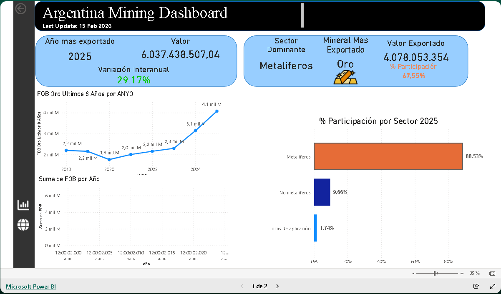

# Argentina Mining Dashboard (Power BI)

## 📊 Descripción del proyecto
Este proyecto presenta un dashboard interactivo desarrollado en Power BI para analizar la evolución y la estructura de las exportaciones mineras de Argentina.

El análisis se centra en identificar patrones estructurales del sector, detectar períodos de máximo desempeño exportador y evaluar el grado de concentración productiva del país.

El dashboard permite explorar la dinámica del sector minero a través de indicadores clave, análisis de participación relativa y tendencias históricas del principal mineral exportado.

---

## 🎯 Objetivo
Analizar la estructura exportadora minera de Argentina, con foco en:

- Identificación del año de mayor exportación histórica
- Medición del crecimiento interanual del sector
- Determinación del sector dominante
- Identificación del mineral con mayor peso exportador
- Participación relativa por sector
- Tendencia histórica del mineral dominante

---

## 🌐 Dashboard online
Ver versión interactiva del proyecto en el portfolio:

👉 https://francochacon.github.io/proyecto2/

---

## 🧮 KPIs principales

- **Año más exportado**  
  Año con mayor valor total de exportaciones mineras (FOB).

- **Variación interanual (YoY)**  
  Crecimiento porcentual del valor exportado respecto al año anterior.

- **Sector dominante**  
  Sector económico con mayor participación en el año de máximo histórico.

- **Mineral dominante**  
  Mineral con mayor valor exportado dentro del año de mayor desempeño.

- **Participación del mineral dominante**  
  Porcentaje del total exportado explicado por el mineral principal.

- **Participación por sector**  
  Distribución relativa de las exportaciones entre sectores mineros.

---

## 🔎 Principales hallazgos del análisis

- 2025 registra el mayor nivel histórico de exportaciones mineras del período analizado.
- El sector metalífero domina ampliamente la estructura exportadora del país.
- El oro es el mineral con mayor peso relativo dentro del total exportado.
- La participación del oro supera ampliamente al resto de los sectores y minerales.
- La serie histórica muestra una tendencia creciente sostenida del valor exportado de oro.
- La estructura exportadora presenta alta concentración en un único mineral.
- Otros sectores mineros poseen participación significativamente menor.

En conjunto, el sector minero argentino muestra un perfil exportador altamente concentrado y especializado.

---

## 📈 Interpretación económica

Los resultados evidencian una fuerte dependencia estructural del sector minero argentino respecto al oro como principal generador de divisas.

Esta concentración implica:

- Alta exposición a variaciones del precio internacional del oro
- Sensibilidad del desempeño exportador a condiciones del mercado global
- Baja diversificación productiva del sector minero
- Vulnerabilidad ante shocks específicos del mercado aurífero

La tendencia creciente del valor exportado sugiere expansión productiva, mejora de precios internacionales o aumento de competitividad del sector metalífero.

---

## 🎯 Implicancias estratégicas

El análisis sugiere:

- Alta dependencia exportadora de un único mineral
- Necesidad potencial de diversificación productiva
- Rol central del sector metalífero en el desempeño exportador
- Sensibilidad estructural a ciclos de precios internacionales

El sector presenta crecimiento sostenido, pero con elevada concentración.

---

## 🧠 Preguntas que responde el dashboard

- ¿Cuál fue el año de mayor exportación minera?
- ¿Qué sector domina la estructura exportadora?
- ¿Qué mineral explica la mayor parte del valor exportado?
- ¿Cómo evolucionó el oro en el tiempo?
- ¿Qué nivel de concentración tiene la matriz exportadora?

---

## 🗂 Modelo de datos
Modelo dimensional basado en tabla de hechos de exportaciones y dimensiones de tiempo, sector y mineral.

(Agregar captura del modelo)

---

## 🧰 Herramientas utilizadas

- Power BI Desktop
- DAX
- Modelado dimensional
- Análisis de series temporales

---

## 📁 Estructura del repositorio
